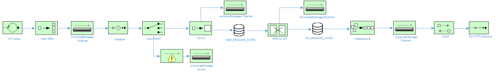

# NSM Data Scrapping

This example demonstrates how to split, validate, and resequence an NSM batch file.

The Camel routes used in this example are explained by the following diagram:

## Prerequisites

The following are required to run this project:

(1) JDK 1.8 or newer
(2) Maven 3.3 or newer
(3) SOAPUi for the mock SOAP endpoint
(4) MySQL or any RDBMS
(5) An SFTP server

### Building

The example can be built with

    mvn clean install
    
Additionally, please ensure the following has been configured:

(1) Setup a mySQL database and run the script located in `/support/schema.sql` to create the necessary database tables.

(2) Startup the mock SOAP endpoint project located in `/support/EIS-soapui-project.xml` which can be run inside of SOAPUI.

(3) Update `/src/main/resources/application.properties` with the necessary credentials for the DB / SFTP / SOAP service

### Running the example in SpringBoot

The example can be run as a standalone SpringBoot instance by executing:

	mvn spring-boot:run

### Running the example in Docker

To build to the project:

    mvn clean package docker:build   
        
    docker run -t example/nsm-data-scrapping
     
Copy a file over to your SFTP server to test the flow.

After you've finished running the docker example, be sure to tidy up:

     docker ps (to obtain the container ID)
     docker stop <container ID>
     docker rm <container ID>